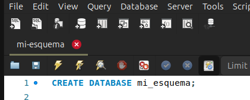
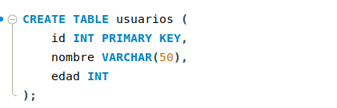
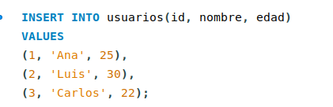
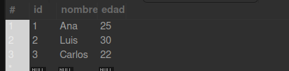

* Creación de la base de datos

* Le de decimos al sistema que vamos a usar la base de datos mi_esquema

* Creamos una tabla

* Insertamos información dentro en la tabla

* Hacemos una consulta a la base de datos

